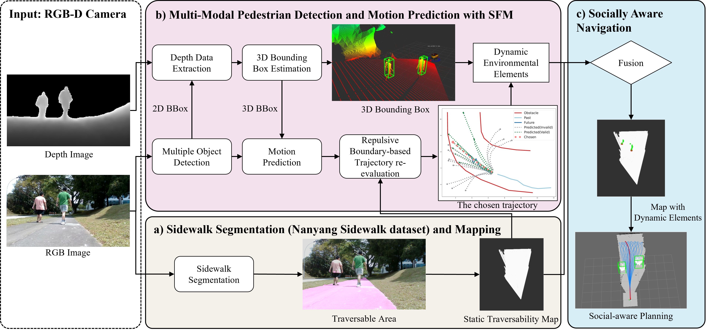

# Last-mile-Socially-Aware-Delivery-Robot
<figure style="text-align:center;">
  
  <figcaption>Three main challenges in last-mile delivery robot navigation</figcaption>
</figure>

This is the official implementation of the paper **"Towards Safe and Efficient Last-Mile Delivery: A Multi-Modal Socially Aware Navigation Framework for Autonomous Robots on Pedestrian-Crowded Sidewalk"**. The paper has been submitted to ICRA 2024 for review.

## 1. Introduction
<figure style="text-align:center;">
  
  <figcaption>Framework</figcaption>
</figure>

**Safe and efficient navigation of delivery robots** in pedestrian-crowded environments is challenging and demanding since it requires robots to analyze where the traversable area is, understand the social intention of pedestrians, and plan motion with social awareness. To address this, we proposed a multi-modal socially aware navigation framework for last-mile delivery robots on pedestrian-crowded sidewalks. This framework comprises three key aspects: 
1) We introduced the **Nanyang Sidewalk dataset**, designed explicitly for class segmentation tasks on sidewalks. we segment the traversable areas on the sidewalk using a model trained on our dataset, generating a static traversability map.
2) A multi-modal 3D detection and motion prediction integrated with the **social force model** has been introduced to perceive the intention of pedestrians. This part can be subdivided into two distinct nodes: **a)** 3D Pedestrian Detection, which leverages multiple modality information to derive accurate 3D bounding boxes of pedestrians. **b)** Pedestrian motion prediction involves the initial forecasting of potential pedestrian trajectories, followed by the selection of the most likely trajectories using the Social Force Model (SFM), specifically through repulsive-boundary-based selection.
3) A socially aware motion planner for the delivery robot is demonstrated by following pedestrian etiquette. Extensive experiments have been conducted to verify and evaluate the performance of the proposed algorithm. pedestrians' positions and predicted trajectories will be further fused with a static traversability map. Based on the final occupancy grid map, socially aware planning is developed to follow pedestrian etiquette in Singapore and navigate delivery robots along the narrow sidewalk.

### 1.1 Nanyang Sidewalk dataset
#### **Download Nanyang Sidewalk Dataset** [here](https://entuedu-my.sharepoint.com/:f:/g/personal/yichen_zhou_staff_main_ntu_edu_sg/EiWSMUAhh6dIukF7rnQqdygBmHAQB__wPmX1BCeHz69IAA?e=60Lchq)
<figure style="text-align:center;">
  
</figure>

The dataset comes from a 1,150-second video recorded by a husky robot with a realsense RGB-D camera. The robot traveled about 1 km along the Nanyang Link sidewalk. We took one image every 11 frames, resulting in an initial collection of 3,000 images. We then removed similar images to increase diversity, resulting in a final dataset of **1,096** images, each with a resolution of 480x848 pixels. The dataset in **Pascal VOC 2012** format can be downloaded [here](https://entuedu-my.sharepoint.com/:f:/g/personal/yichen_zhou_staff_main_ntu_edu_sg/EiWSMUAhh6dIukF7rnQqdygBmHAQB__wPmX1BCeHz69IAA?e=60Lchq).

<figure style="text-align:center;">
  
  <figcaption>Visualization of segmentation results (Mask2Former)</figcaption>
</figure>

<figure style="text-align:center;">
  
  <figcaption>Performance Comparsion</figcaption>
</figure>

### 1.2. Pedestrian Intention Prediction

#### a. Pedsim Scenarios
<figure style="text-align:center;">
  
</figure>

#### b. Repulsive-Boundary-based Trajectory prediction

<figure style="text-align:center;">
  
</figure>

### 1.3. Socially Aware Motion Planner
#### a. Overtaking from the right side
<figure style="text-align:center;">
  
</figure>

#### b. Running along from the left side
<figure style="text-align:center;">
  
</figure>

## acknowledgements
We thank the authors of [Pedsim](https://github.com/srl-freiburg/pedsim_ros) for providing the pedestrian simulation environment. We also thank the authors of [MMSegmentation](https://github.com/open-mmlab/mmsegmentation) for providing the semantic segmentation framework. We also thank the authors of [Agentformer](https://ye-yuan.com/agentformer/) for providing the pedestrian trajectory prediction framework.
